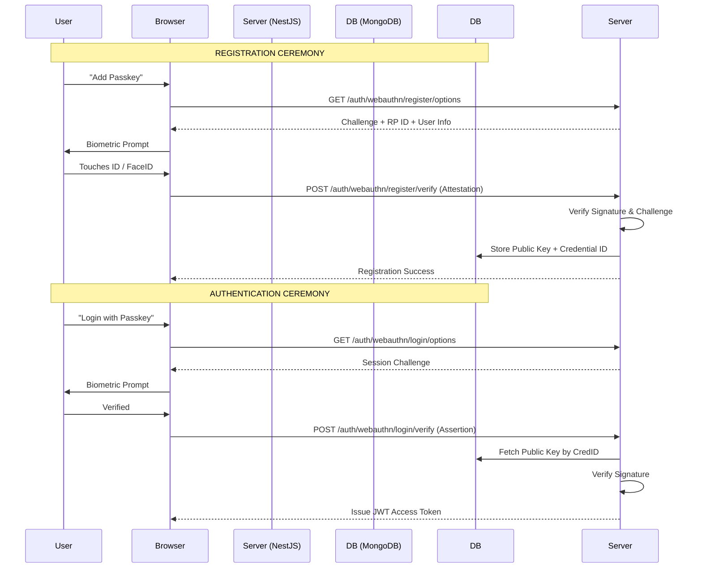

# WebAuthn (Passkeys) Strategy: Phasing Out Passwords

This document outlines the strategic implementation of **WebAuthn (Passkeys)** as a primary or secondary authentication factor in our administrative ledger. WebAuthn provides unphishable, hardware-backed biometric security (FIDO2 standard) for the most critical administrative sessions.

## 1. Overview: Why Passkeys?
Passkeys (WebAuthn) replace vulnerable shared secrets (passwords) with asymmetric cryptography. 
*   **Security:** Multi-factor by design (Something you have + Something you are).
*   **UX:** Biometric login (FaceID, TouchID, Windows Hello) in < 2 seconds.
*   **Resistance:** Immune to phishing and mass credential leaks.

## 2. Technical Architecture



## 3. Implementation Roadmap

### Phase 1: Core Dependency Injection
We will utilize the industry-standard library [SimpleWebAuthn](https://simplewebauthn.dev/) to handle the low-level binary buffer parsing and signature verification.

*   **Server:** `@simplewebauthn/server`
*   **Client:** `@simplewebauthn/browser`

### Phase 2: Schema Hardening
Add an `authenticators` array to the `User` schema in MongoDB.

```typescript
// Proposed Sub-schema
interface Authenticator {
  credentialID: Buffer;
  credentialPublicKey: Buffer;
  counter: number;
  credentialDeviceType: string;
  credentialBackedUp: boolean;
  transports?: AuthenticatorTransport[];
}
```

### Phase 3: Registration Logic (The Ceremony)
1.  **Generate Options:** Backend creates a unique challenge and stores it temporarily in the user's session.
2.  **Verify Attestation:** Receive the public key and credential ID from the browser and save it to the user's profile.

### Phase 4: Authentication Logic (The Assertion)
1.  **Retrieve Account:** Match the user based on the `credentialID` returned by the hardware.
2.  **Signature Audit:** Verify the assertion signature against the stored `credentialPublicKey`.
3.  **Counter Check:** Ensure the `counter` is higher than the last used value to prevent replay attacks.

## 4. Administrative Security Rules
In our "Command Center", the following rules will apply to Passkeys:
*   **P0 - Mandatory for Super Admins:** All users with the `super_admin` role will be required to register at least one passkey.
*   **P1 - Recovery Codes:** Since passkeys are hardware-bound, a set of 12 static recovery codes must be generated during the first enrollment.
*   **P2 - Revocation Ledger:** Admins can view and revoke specific hardware keys from the user detail page.

## 5. Security Checklist
- [ ] **Domain Verification:** Ensure `rpID` strictly matches our high-level domain.
- [ ] **Cross-Origin Protection:** Validate the origin in every attestation.
- [ ] **User Handle Verification:** Store the `user.id` as a UUID string to avoid leaking MongoDB `ObjectId` structure to the device.
- [ ] **Attestation Type:** Use `none` for privacy unless strict hardware audit is required.

---
*Created: April 2, 2026* | *Rev: 1.0 (WebAuthn Focus)* | *Status: Planning*
